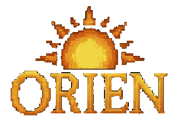

# Orien: An Eternal Quest (v1.0.5)

Welcome to **Orien: An Eternal Quest**, an OCaml project featuring SDL and JavaScript builds, and following the ECS architecture.

## Build Instructions

At the root of the project, run:

```bash
dune build @all
```
This will build both the SDL and JavaScript versions.

## Running the Project

- **To run the SDL version:**

```bash
dune exec prog/game.exe
```

- **To run the JavaScript version:**

```bash
python3 -m http.server
```
This will serve the project on [localhost:8000](http://localhost:8000).

## Documentation

For more details about the project design, structure, and implementation, please refer to the project report available at:

```text
./report.pdf
```

---

> Feel free to explore and enjoy the quest! ☀️
